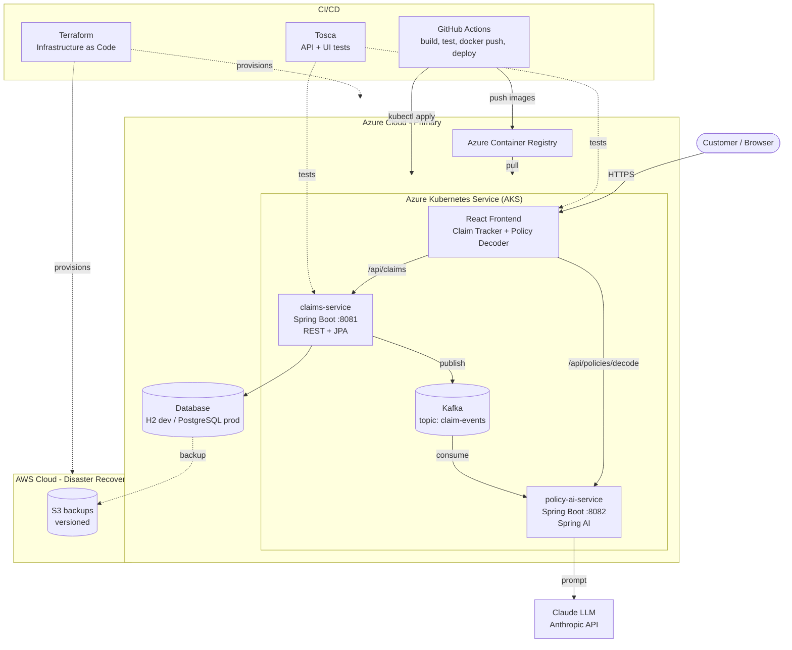

# FinSure Central

## 1. Brief about the Application
FinSure Central is a full-stack finance and insurance platform that helps people understand their insurance policies and track their claims. Customers submit a claim and follow it through a clear status timeline, and they can paste policy wording to get a plain-language breakdown of exclusions, caps, waiting periods and co-pay clauses.

## 2. About the Tech Stack
| Layer | Technology |
|---|---|
| Frontend | ReactJS (Vite) |
| Backend | Java 21, Spring Boot 3.4 REST APIs, Spring Boot microservices |
| AI | Spring AI with Anthropic Claude (policy decoding) |
| Messaging | Apache Kafka (`claim-events` topic) |
| Database | H2 (development), JPA/Hibernate |
| Containers and orchestration | Docker, Kubernetes (Azure AKS) |
| Cloud and CI/CD | Azure (AKS, ACR), GitHub Actions pipeline |
| Disaster recovery | AWS (S3 backup target) |
| Infrastructure as Code | Terraform |
| Testing | Tosca |

## 3. Application Architecture

## 4. What This Application Is All About
Insurance and finance products are hard to understand. People often find out about sub-limits, room-rent caps, waiting periods and co-pay clauses only when a claim is rejected, and then they cannot tell why it was rejected or what stage it is at. FinSure Central addresses this in two ways:
- **Claim tracking:** submit a claim against a policy number, follow it through SUBMITTED, DOCS_VERIFIED, UNDER_REVIEW, APPROVED, REJECTED and PAID, and see the rejection reason when there is one. Every status change is published as an event on Kafka.
- **AI policy decoder:** paste the policy wording and an LLM, guided by a strict system prompt, lists the exclusions, caps, waiting periods, co-pay clauses and claim-rejection risks in plain language, quoting clause numbers when present and saying so when something is not in the text.

## 5. How This Application Differs from Other Applications
Most insurer, bank and policy-administration apps serve the provider: they store policies, process premiums and handle claims internally. FinSure Central serves the customer's understanding instead.
- **Plain-language policy explanation:** it surfaces the clauses that usually cause surprises at claim time, instead of leaving customers to read a 60-page policy document.
- **Claim transparency:** it shows status and rejection reasons in one place, not scattered across hospital and insurer channels.
- **Event-driven design:** claim updates flow through Kafka, so further services (notifications, rejection-reason explainers, fraud checks) can be added without changing the claims service.
- **Cloud-native by default:** independent microservices, containerised, deployed to Kubernetes through CI/CD and defined as code with Terraform, with an AWS disaster-recovery target.
